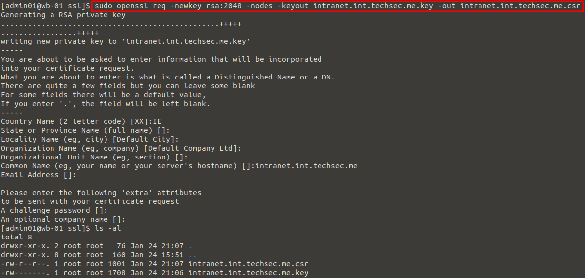
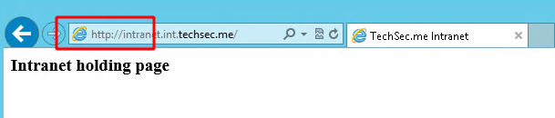
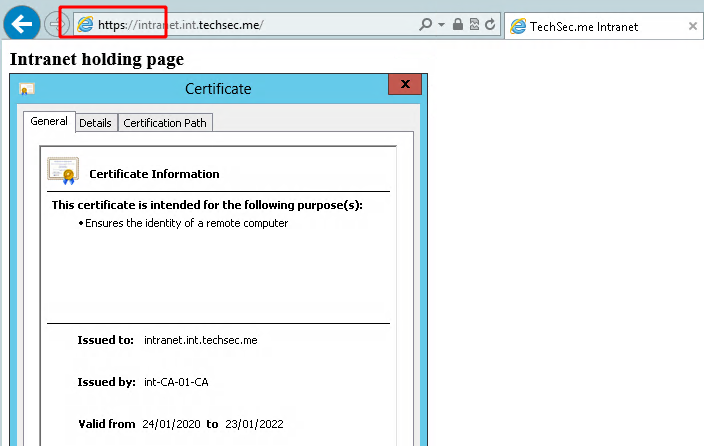

<!--
.. title: apache ssl using a windows ca
.. slug: apache-ssl-using-a-windows-ca
.. date: 2020-01-25 22:00:12 UTC
.. tags: linux, security, windows server, web
.. category: 
.. link: 
.. description: 
.. type: text
-->

##### If you've a Windows Domain with a Certificate Authority in place, this procedure will demonstrate how to issue an SSL certificate for an internal Apache server running Linux, CentOS in this case.  In the example below we enable https on an intranet.

**Stage 1: Generating a CSR for your virtual host.**

First we generate a key and certificate request for our intranet using openssl on the Linux server.  We can later copy the resulting .csr to our Windows CA to generate the certificate from.

```bash
sudo mkdir /etc/httpd/ssl
cd /etc/httpd/ssl
sudo openssl req -newkey rsa:2048 -nodes -keyout intranet.int.techsec.me.key -out intranet.int.techsec.me.csr
```


<!-- TEASER_END -->

**Stage 2: Generate the certificate on our Windows CA**

Now we copy the cert request file to our Windows Certificate Authority.  We can't use the CA mmc to generate the certificate as it does not support converting the openssl .csr format so instead we can use Microsoft's 'certreq' command line tool to do this.

```powershell
cd c:\crts
certreq -submit -attrib "CertificateTemplate:WebServer" .\intranet.int.techsec.me.csr
```


We then export the generated certificate and the intermediary certificate from the CA mmc in base 64 format which we can copy to our Linux server.


Do the same for the CA's cert which we'll use as the intermediary certificate.  Copy them over to the Linux server.

**Stage 3: Configuring our virtual host for https**

Now that we have the Windows CA generated .cer files on our Apache server we should have all 3 files we need to set up https on our site.  The intranet cert, the intermediary cert and the private key.

```bash
cd /etc/httpd/ssl
[admin01@wb-01 ssl]$ ls -la
-rw-r--r--. 1 root root 1295 Jan 24 22:20 intermediary.techsec.me.cer
-rw-r--r--. 1 root root 1949 Jan 24 22:19 intranet.int.techsec.me.cer
-rw-------. 1 root root 1708 Jan 24 21:06 intranet.int.techsec.me.key
```

We now edit our /etc/httpd/sites-enabled/intranet.int.techsec.me.conf Virtual Host config file to enable SSL for the site and point to our certificate files.  Restart Apache once this has been done, below are the highlighted changes.


And here we can see the testing of the site

Before SSL is enabled:



After SSL is enabled:



There we have it, now all your Windows domain joined clients can connect over https to your internal webserver without getting cert errors.


* Note if you didn't do it already you need to create an A Record in your Windows DNS to point intranet.int.techsec.me to the Linux server.
* Note also, permissions and properties are important on the files within the /etc/httpd/ssl folder, if you have issues starting Apache double check these inc the SELinux attributes.
* Bonus note, if you're given a .p7b cert from the CA you can extract the required certs using openssl e.g. openssl pkcs7 -inform DER -outform PEM -in intranet.int.techsec.me.p7b -print_certs