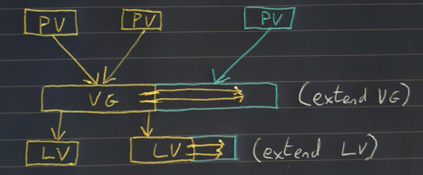
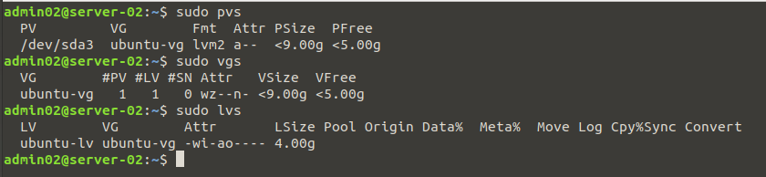
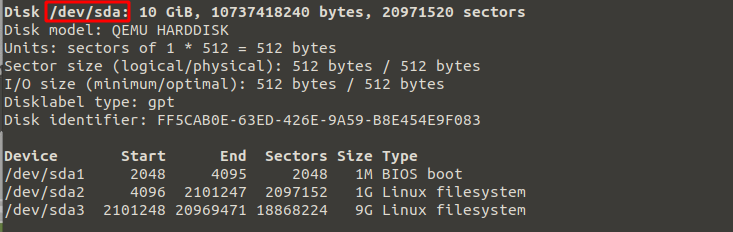
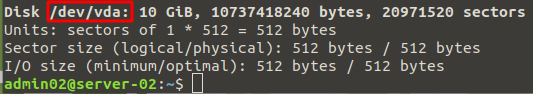
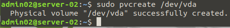
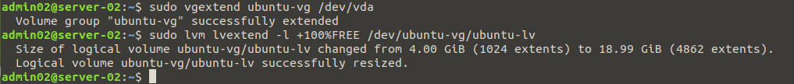
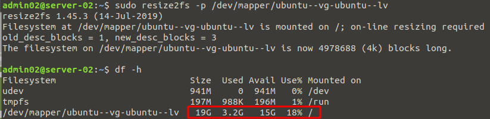

<!--
.. title: extend volume to new physical disk with lvm
.. slug: extend-volume-to-new-physical-disk-with-lvm
.. date: 2020-02-06 21:59:02 UTC
.. tags: linux, sysadmin, storage, bash
.. category: 
.. link: 
.. description: 
.. type: text
-->

##### The initial OS was installed using LVM so extending it is relativly straight forward.  The steps below describe the process, here the Ubuntu server / was running low on space.  I added a new disk and extended the existing volume to use the new disk increasing the free space on root /



Example image above shows an initial storage configuration on the left.  The right shows additional storage added later and used to extend existing volume.

<!-- TEASER_END -->

**Stage 1: Gather Info**

First things first is to gather information on the currenet disk setup so you can ID the VG and Partition you will be expanding.  1 or more PVs are added to a VG on which one or move LV can sit.  So below we take a look at the current volumes (Physical Volume, Volume Group, Logical Volume) on the server.
```bash
sudo pvs
sudo vgs
sudo lvs
```


If we take a look at fdisk -l we can see our current disk.
```bash
sudo fdisk -l
```


**Stage 2: Add New Disk**

Now we have a good idea of the current configuration of our server's storage we add the new disk (in this case a virtual disk).  We can use fdisk -l again to confirm it is seen by the OS.  We then need to create our PV from the new disk which will allow us to add it to our existing VG.
```bash
sudo fdisk -l
```


```bash
sudo pvcreate /dev/vda
```


**Stage 3: Add our newely create PV to our existing VG**

Once we have sucessfully created the PV using the new disk, we need to add it to the VG and then extend the LV to allow us make use of the additional space.

```bash
sudo vgextend ubuntu-vg /dev/vda
sudo lvm lvextend -l +100%FREE /dev/ubuntu-vg/ubuntu-lv
```


While we have now sucessfully added the space to the volume, we need to resize the actual filesystem before it's accessible to us.

```bash
df -h
```


As you can see from above, the additional space is still not available to the OS.  Now we resize the filesystem and we should then see the new space.

```bash
sudo resize2fs -p /dev/mapper/ubuntu--vg-ubuntu--lv
df -h
```

