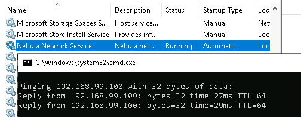
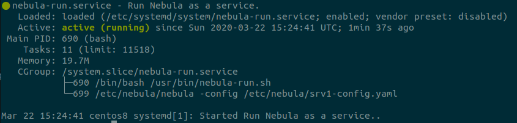

<!--
.. title: run nebula as a service
.. slug: run-nebula-as-a-service
.. date: 2020-03-20 20:30:33 UTC
.. tags: sysadmin, vpn, nebula, networking
.. category: 
.. link: 
.. description: 
.. type: text
-->

##### I recently looked at using Nebula to create a private network between a few devices, [my post here](https://techsec.me/home/setting-up-nebula-overlay-network/ "TechSec.me - Setting up Nebula") goes through the setup process.  [Nebula ](https://github.com/slackhq/nebula "Nebula - GitHub Link") (from the people that brought you Slack) turned out to be a great fit for my requirement so below I'm detailing how to setup devices to automatically connect to the overlay network.  I will skip over the install as I covered that in my previous post.

**Stage 1: Generate the certs for all devices**

* dc-02 - 192.168.99.60 (VPS with WAN IP, Lighthouse)
* pc-01 - 192.168.99.61 (Local VM on NAT)
* pc-02 - 192.168.99.62 (Local VM on NAT)

<!-- TEASER_END -->

```bash
./nebula-cert sign -name "dc-02" -ip "192.168.99.60/24"
./nebula-cert sign -name "pc-01" -ip "192.168.99.61/24"
./nebula-cert sign -name "pc-02" -ip "192.168.99.62/24"
```

**Stage 2: Set nebula to run as a service on Windows devices**

Now we copy the certs to the respective devices where we already have the nebula binary downloaded and our .yaml config file.  Running the following command sets up nebula to run as a service.  The ```-service``` options are ```["start" "stop" "restart" "install" "uninstall"]```

```
PS C:\Program Files\nebula> .\nebula.exe -config "C:\Program Files\nebula\dc-02.yaml" -service install
```



**Stage 3: Set nebula to run as a service on Linux devices**

In the previous post I had setup a Linux VPS (srv1) on my nebula network as the Lighthouse, now I want to set it to automatically connect so we need to create a systemd config for this to happen and we'll use the existing nebula config file and certs.

* srv1 - 192.168.99.100 (VPS with WAN IP, Lighthouse)

First we create a simple .sh file in ```/usr/bin/nebula-run.sh``` containing the command to start nebula using our config file.  We'll also send any output to /var/logs which will help troubleshooting efforts if needed.  Contents of our file:

```bash
/etc/nebula/nebula -config /etc/nebula/srv1-config.yaml &>>/var/log/nebula-err.log
```

then:

```bash
sudo chmod +x /usr/bin/nebula-run.sh
```

Now we create a systemd unit file to allow the system run our script as a service.  We create the following ```sudo vi /etc/systemd/system/nebula-run.service``` with the content below:

```bash
[Unit]
Description=Run Nebula as a service.

[Service]
Type=simple
ExecStart=/bin/bash /usr/bin/nebula-run.sh

[Install]
WantedBy=multi-user.target
```

then:

```bash
sudo chmod 644 /etc/systemd/system/nebula-run.service
sudo systemctl enable nebula-run
```

You can just start the service uses systemctl but I rebooted the server as a test, once the server came back up, all devices on the nebula network could communicate and the service on the lighthouse showed up as running.



* Note initally when I installed the nebula service on Windows I was using ```-config .\dc-02.yaml``` but received an error 1067 when trying to start the service.  Adding the full path to the config file resolved this issue.