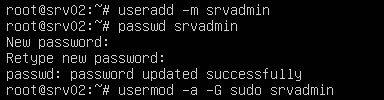
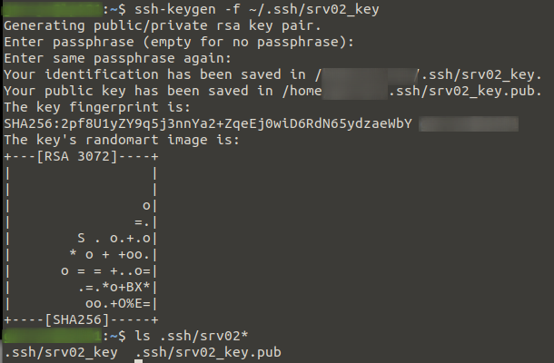
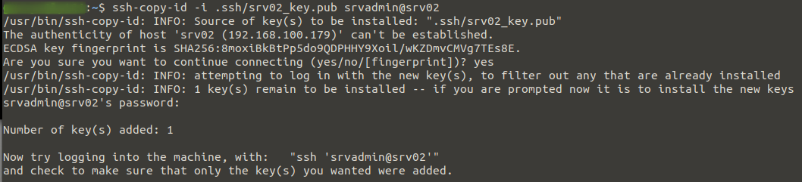
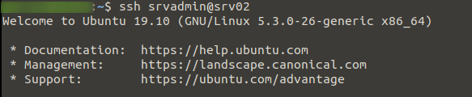
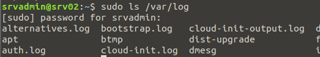

<!--
.. title: secure ssh access using keys
.. slug: secure-ssh-access-using-keys
.. date: 2020-01-30 22:00:32 UTC
.. tags: linux, security, ssh
.. category: 
.. link: 
.. description: 
.. type: text
-->

##### In order to secure SSH access to a newly deployed Linux server it is highly recommended you disable password based SSH logins and instead force key based logins as it practically eliminates the possibility of a brute force login attack being successful.  There are a few steps to setting this up which I go through below.

**Stage 1: Account Setup**

We're assuming the only account on first boot is root so first thing we need to do is create a new user for remote access and give it sudo privileges.
```bash
useradd -m srvadmin
passwd srvadmin
usermod -a -G sudo srvadmin
```


<!-- TEASER_END -->

**Stage 2: Key Setup**

On your local machine or whatever machine you will be connecting to the server from, create a key pair for use in authenticating to the server.  Then we copy the public key to the remote server under the user we created earlier (srvadmin).  In the example below we user ssh-copy-id to copy the public key over but it could be done manually too.
```bash
ssh-keygen -f ~/.ssh/srv02_key
```

```bash
ssh-copy-id -i .ssh/srv02_key.pub srvadmin@srv02
```


**Stage 3: Testing**

Leaving the current session from Stage 1 running, start a new session logging in with the new account.  If everything went well we will not be asked for a login password as it will first try using our key to authenticate, note if you set a password to protect your key you will be asked for that.

We then run any command with sudo to confirm we have successful remote access to the server and can perform admin tasks without using the root account.
```bash
ssh srvadmin@srv02
```

```bash
sudo ls /var/log
```


**Stage 4: SSH Lock-down**

Once everything worked at the above stages we now need to do two things to lock down the sever.  First we disable ssh password logins and second we disable root access over ssh.  For these reasons it is imperative you test your remote access using the none-root account before disabling root access over ssh.

Set the two parameters below in the /etc/ssh/sshd_config config file then restart the sshd service
```bash
sudo vi /etc/ssh/sshd_config

PermitRootLogin no
PasswordAuthentication no

sudo systemctl restart sshd
```
To test you can exit from the root session from Stage 1 and try connecting again, you should receive an error. e.g.:
```bash
root@srv02: Permission denied (publickey).
```

