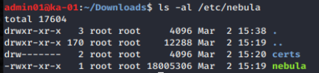
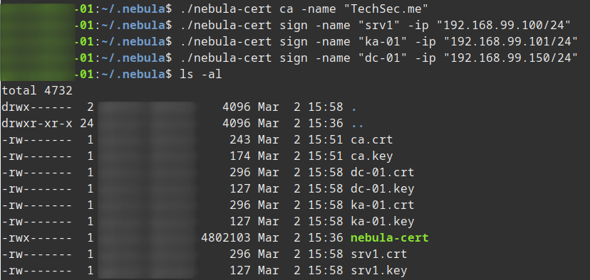
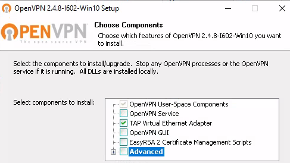

<!--
.. title: setting up nebula overlay network
.. slug: setting-up-nebula-overlay-network
.. date: 2020-03-05 21:05:21 UTC
.. tags: sysadmin, vpn, nebula, networking
.. category: 
.. link: 
.. description: 
.. type: text
-->

##### I really like WireGuard as a fast, simple and secure VPN option.  Recently I have a requirement to be able to add and remove nodes to a VPN on a semi regular basis and as I do not have any sort of config manager in place (yet!) I need an option that doesn't require making changes on all existing nodes.  Nebula (from the people that brought you Slack) is one such option and below is how I've set it up, it's great in that I can add a node, do the bit of work I need to do with it then remove it a few weeks later and I don't need to make config changes on all the other nodes.

**Stage 1: Setup Nebula**

[Nebula is provided as source](https://github.com/slackhq/nebula "Nebula - GitHub Link") or as [downloadable binaries](https://github.com/slackhq/nebula/releases "Nebula - Binaries"), there is no pre-built package or installer yet so for the initial setup I'll be configuring three nodes, a Linux VM with a public IP (Nebula refer to this as a Lighthouse) and two internal VMs behind NAT, one Windows Server at home and a Linux VM on a laptop.

* srv1 - 192.168.99.100 (VPS with WAN IP, Lighthouse)
* ka-01 - 192.168.99.101 (Local VM on NAT)
* dc-01 - 192.168.99.150 (Local VM on NAT)

<!-- TEASER_END -->

For my setup I will generate all certs and store the CA certificate using my laptop which for now at least will not be part of the new network.  Obviously store the CA cert somewhere safe.

On each node, download and extract the relevant binary then set it up as:

```bash
sudo mkdir /etc/nebula
sudo mkdir /etc/nebula/certs
sudo chmod 600 /etc/nebula/certs
sudo cp ~/Downloads/nebula /etc/nebula/
```



**Stage 2: Generate our certs from the chosen CA machine.**

Now we need to generate our certificates for any nodes that will be in the overlay network.  In my case I'm using a seperate computer to generate the certificates and I'll copy them over to each node.  This should make it easy when adding additional nodes in the future plus it gives me a single location for all my certs I need to secure and backup.

```bash
./nebula-cert ca -name "TechSec.me"
./nebula-cert sign -name "srv1" -ip "192.168.99.100/24"
./nebula-cert sign -name "ka-01" -ip "192.168.99.101/24"
./nebula-cert sign -name "dc-01" -ip "192.168.99.150/24"
```



**Stage 3: Setup our nodes and connect.**

For each node we now need to download a few items:

- The Nebula binary file [available here](https://github.com/slackhq/nebula/releases "Nebula Binaries - GitHub").
- The config file [sample config available here](https://github.com/slackhq/nebula#5-configuration-files-for-each-host "Nebula Config File - GitHub") which we will adjust as necessary.
- The respective certs generated in the previous step (ca.crt, device.crt and device.key for the respective node).

We then fire up the connection from the folder containing the config files and certs using the command below.

```bash
sudo ./nebula -config ka-01-config.yaml

$ ping 192.168.99.100
PING 192.168.99.100 (192.168.99.100) 56(84) bytes of data.
64 bytes from 192.168.99.100: icmp_seq=4 ttl=64 time=265 ms
64 bytes from 192.168.99.100: icmp_seq=5 ttl=64 time=55.0 ms
64 bytes from 192.168.99.100: icmp_seq=6 ttl=64 time=50.1 ms
64 bytes from 192.168.99.100: icmp_seq=7 ttl=64 time=48.9 ms
```

* You will probably get an error when running nebula on Windows similar to: Failed to find the tap device in the registry.  The quickest way around this I found was to install OpenVPN.  Note these minimal install setting worked for me:



* Note once I'm happy with the system and process around adding new nodes I'll set these up to start automatically.  In Version 1.1 the developers have added a ```-service``` option to automatically add a service for Windows and OSX and we can set something similar up for our Linux machines.
* Note logging is your friend, set it to ```debug``` if you're running into trouble, this helped me pinpoint a config error in my .yaml config file. Kudos to the developers too who are very responsive over on [GitHub](https://github.com/slackhq/nebula)

