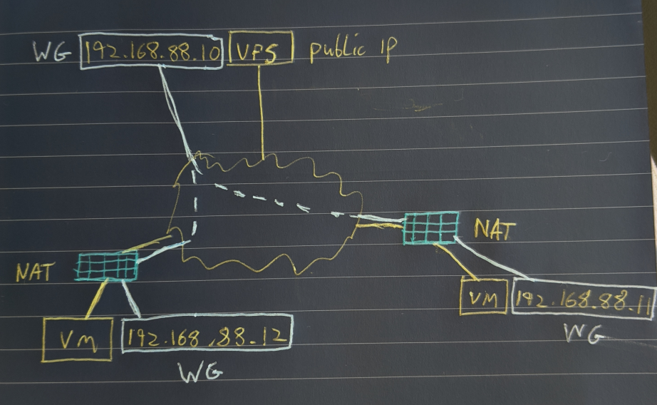
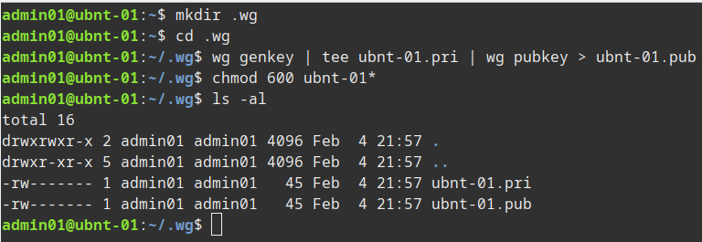
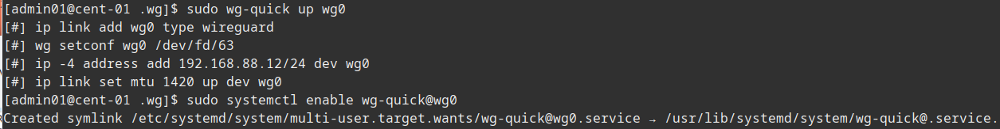
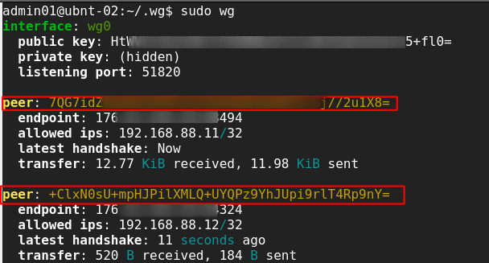
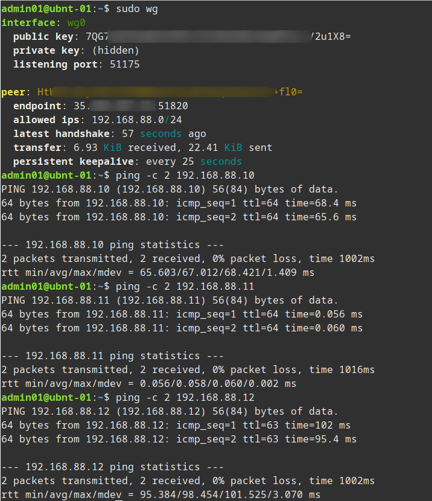

<!--
.. title: setup wireguard vpn
.. slug: setup-wireguard-vpn
.. date: 2020-02-11 22:01:42 UTC
.. tags: linux, vpn, security, wireguard
.. category: 
.. link: 
.. description: 
.. type: text
-->

##### WireGuard is a fast, easy to configure VPN.  If you have at least one node with a public IP all devices will be able to communicate with each other regardless of NAT or port forwards.  The setup below has three nodes, one VPS node with a public IP and two additional nodes, both behind NAT.



**Stage 1: Install WireGuard on our clients.**

I'm not going to re-produce the install procedure, WireGuard have very good documentation [available here](https://www.wireguard.com/install/ "WireGuard Install Guide").  I installed on three systems, two Ubuntu 19.10 Servers and one CentOS 8.

* ubnt-01 (Local VM)
* ubnt-02 (VPS with WAN IP)
* cent-01 (Local VM)

Once installed you can run ```sudo wg``` to check if it's installed, you will get an error if it's not.

<!-- TEASER_END -->

**Stage 2: Generate our public and private keys on the three nodes.**

Now we need to generate our keys for WireGuard to use.  The same process can be used on the three nodes (substituting the server name in my example below). Make sure to secure them.  I create a .wg folder in my home folder but you can create and store then where ever you wish, we will be copying the content of the keys to the config files later so the files themselves do not need to be saved in any particular location.

```bash
mkdir .wg
cd .wg
wg genkey | tee ubnt-01.pri | wg pubkey > ubnt-01.pub
chmod 600 ubnt-01*
```


**Stage 3: Create our WireGuard config on each server.**

You should now have three sets of keys, one on each server.  We now create the config file on each server, we also make sure the config file is not world readable.  We'll call the interface wg0 in the example below.  We use the range 192.168.88.0/24 for our WireGuard network.

__First we have the config for the server with the WAN IP:__

```bash
sudo vi /etc/wireguard/wg0.conf
sudo chmod 600 /etc/wireguard/wg0.conf

# This is our external node config, the IP and port it will use and the private key (just cat the contents)
[Interface]
Address = 192.168.88.10/24
ListenPort = 51820 # Server Listening Wireguard Port
PrivateKey = mBtIxxxxxxxxxxxxxxxxxxxxxxxxxxzdlc=

# Now we enter the other clients in the network
# ubnt-01 - Laptop
[Peer]
PublicKey = 7QG7xxxxxxxxxxxxxxxxxxxxxxxxxx/2u1X8=
AllowedIPs = 192.168.88.11/32

# cent-01 - Home VM
[Peer]
PublicKey = +ClxNxxxxxxxxxxxxxxxxxxxxxxxxxxp9nY=
AllowedIPs = 192.168.88.12/32

```

__Then we have the config for our clients behind NAT:__

```bash
sudo vi /etc/wireguard/wg0.conf
sudo chmod 600 /etc/wireguard/wg0.conf

# This is our ubnt-01 config, the IP it will use and the private key (just cat the contents)
[Interface]
Address = 192.168.88.11/24
PrivateKey = UIzxxxxxxxxxxxxxxxxxxxxxxxxxxxxxxxxgpPXY=

# This is the ubnt-02 config which in our case is the external device with a WAN IP
[Peer]
PublicKey = HtWVExxxxxxxxxxxxxxxxxxxxxxxxxxxxx5+fl0=
## All traffic to this range will be sent to this peer
AllowedIPs = 192.168.88.0/24
Endpoint = 35.xxx.xx.xx:51820
## Use if you wish to keep connection to server alive e.g. if client is behind NAT
PersistentKeepalive = 25
```

**Stage 4: Bring up our WireGuard VPN and test.**

Now we need to start the WireGuard connection on each node, we also set it to start automatically.  Finally we can use the wg command to see the status of our network.

```bash
sudo wg-quick up wg0
sudo systemctl enable wg-quick@wg0
```


Now on the server if we check ```sudo wg``` we can see the status of all the nodes.



If we check ```sudo wg``` on one of the nodes behind nat we can just see the server status.


However on that same node we can ping any of the other nodes.




* Note depending on the server you might need to enable IP Forwarding, one way to do this is check ```cat /proc/sys/net/ipv4/ip_forward``` and if not set to 1 run: ```echo 1 | sudo tee /proc/sys/net/ipv4/ip_forward```
* After a recent update my WireGuard server stopped forwarding traffic so I also had to add the following line ```net.ipv4.ip_forward=1``` to ```/etc/sysctl.conf```


