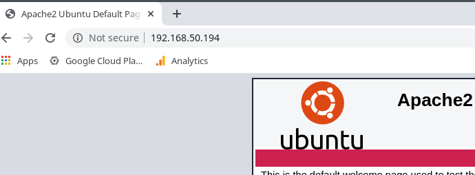
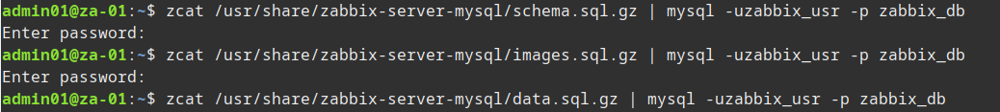
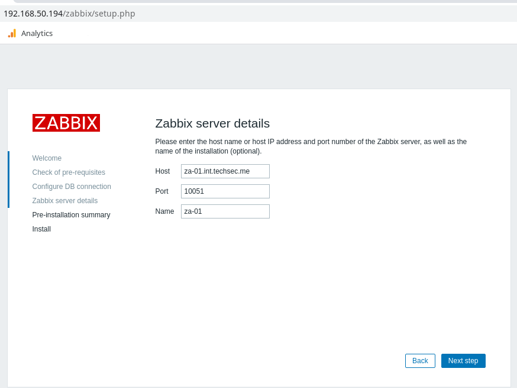
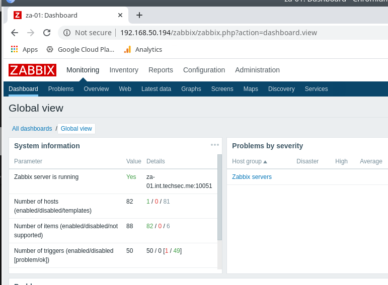

<!--
.. title: zabbix 4 server installation
.. slug: zabbix-4-server-installation
.. date: 2020-03-01 22:03:44 UTC
.. tags: linux, sysadmin, monitoring, zabbix
.. category: 
.. link: 
.. description: 
.. type: text
-->

##### Zabbix is a great monitoring solution and is ideal for environments where you might not be adding devices all that often such as SMEs.  What I mean by this is it's simple to add devices via the GUI, where as with a solution like Nagios with it's config file management it can be a bit time consuming especially if you don't interact with the config on a regular basis.

I plan to do a few quick guides around Zabbix, my aim is to install it and configure it to monitor a few servers and services I have running so each quick guide will build on top of the other.  First up is the install procedure, I'm using a Ubuntu 19.10 Server VM as the OS (40GB disk, 2GB RAM, 1vCPU).

**Stage 1: System Install.**

Starting with a clean install of Ubuntu 19.10 and ran updates we can then look at the Zabbix [system requirements](https://www.zabbix.com/documentation/current/manual/installation/requirements "Zabbix system requirements").  Current version at time of writing is 4.4 and I'll install with MariaDB and Apache.

Install MariaDB and configure:

```bash
sudo apt install mariadb-server
sudo systemctl enable mariadb
sudo systemctl start mariadb

# We run this to set a root password and remove root remote access etc.
sudo mysql_secure_installation
```
<!-- TEASER_END -->

Install base Apache and PHP and configure:

```bash
sudo apt install apache2 php
sudo systemctl enable apache2
sudo systemctl start apache2
```

Install required Apache/ PHP Extensions:

```bash
sudo apt install php-gd php-bcmath php-common php-xml php-mbstring php-mysqli
sudo systemctl restart apache2
```

That should be the base requirements installed, you should be able to browse to the IP of the VM and get the default Apache holding page.



**Stage 2: Installation of Zabbix.**

Pretty much following the install guide provided by Zabbix, I'm just including it below to document the specific steps followed for the configuration we're running.

```bash
# First we install the main Zabbix components
sudo apt install zabbix-server-mysql
sudo apt install zabbix-frontend-php zabbix-agent
```

Now we need to create a database for Zabbix and a DB account for the service.

```bash
sudo mysql -u root -p
CREATE DATABASE zabbix_db;
CREATE USER 'zabbix_usr'@'localhost' IDENTIFIED BY 'XXXXXXXXXX';
GRANT ALL ON zabbix_db.* TO 'zabbix_usr'@'localhost';
exit;
zcat /usr/share/zabbix-server-mysql/schema.sql.gz | mysql -uzabbix_usr -p zabbix_db
# above command took a few minutes
zcat /usr/share/zabbix-server-mysql/images.sql.gz | mysql -uzabbix_usr -p zabbix_db
zcat /usr/share/zabbix-server-mysql/data.sql.gz | mysql -uzabbix_usr -p zabbix_db
```



Edit the zabbix config file to use the DB details configured previously:

```bash
vi /etc/zabbix/zabbix_server.conf
DBHost=localhost
DBName=zabbix_db
DBUser=zabbix_usr
DBPassword=<password>
```

There's also a timezone setting that must be set in the zabbix apache config file.  Just un-comment the line in the config file and enter your location then enable the config:

```bash
sudo vi /etc/apache2/conf-available/zabbix-frontend-php.conf
php_value[date.timezone] = Europe/London # un-comment this line and edit to your location
sudo a2enconf zabbix-frontend-php
sudo systemctl reload apache2
sudo systemctl start zabbix-server
sudo systemctl enable zabbix-server
```

That should be it, Zabbix should be available on the IP now at http://ipaddress/zabbix  Follow the prompts to get it setup:


You should have all greens in the next page:





You might get a permissions error on the next page, you can just manually create the file ```sudo vi /etc/zabbix/zabbix.conf.php``` and copy the content from the file on the download link:


You should now get the login page, you can login with the default Zabbix username and password of 'admin' and 'zabbix' respectivly.  Make sure to change the password once you login.




The above was the basic install procedure for Zabbix, in later posts we will deal with additional configuration of the service.

* Note make sure you have the full server name configured in your hosts and hostname file.

